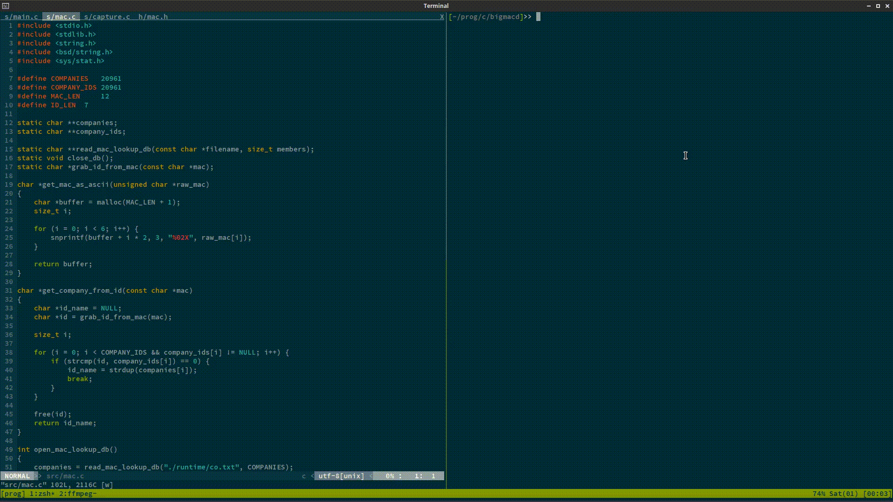

# bigmacd

`bigmacd` is a daemon that tracks and stores MAC addresses.  

- Storing MAC addresses in an SQL database.
- Tracking when the MAC was first and last seen
- Tagging MAC addresses with identifier strings
- Tagging MAC addresses with a shell script to execute when seen
- Possibly a web interface

For now, to build and run it:  

```bash
$ make && sudo ./bigmacd --capture [interface]`
```

You must run as root to set your wireless card to monitor mode.


